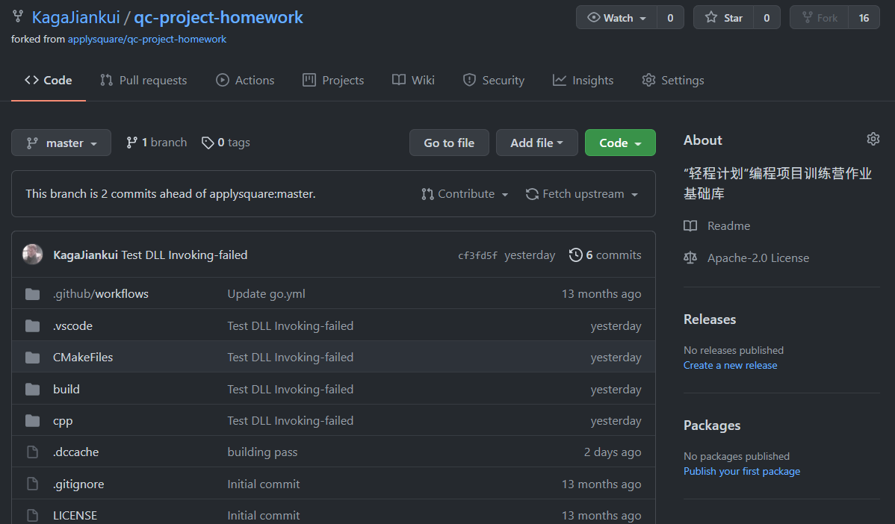
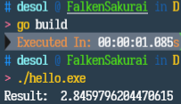
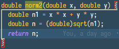

# “轻程计划”编程项目训练营作业基础库

------------

## Week 1

### 如何完成作业

- 1、Fork本仓库 **已完成**
- 2、在自己的代码仓库完成功能开发,并通过Build **已完成**
- 3、按照要求提交作业 **已完成**

### 提交作业地址

<https://teaching.applysquare.com>

Fork仓库:

Build & Run:

source of DLL:

-------------

## Week 2
